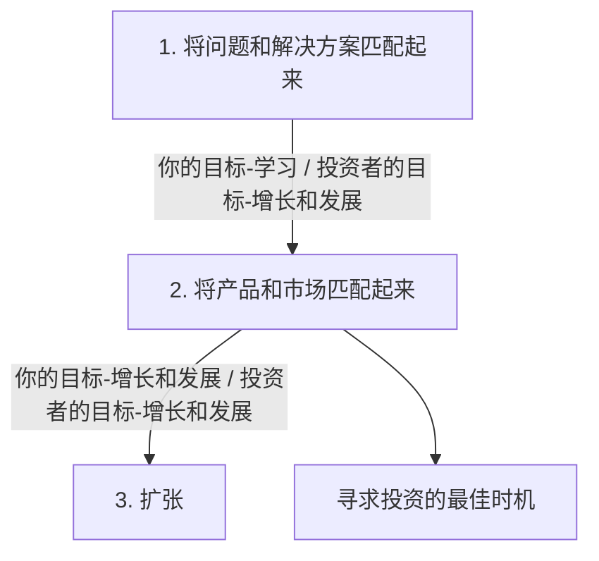
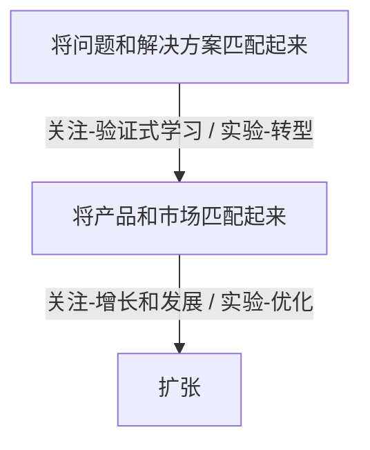

# 精益创业实战（第2版）-莫瑞亚--读书笔记

<!--more-->
# 精益创业实战（第2版）-莫瑞亚--读书笔记
> 必须接受一个现实，那就是创业之初的理念大部分是建立在未经测试的假设（或者猜想）之上的，明白这一点非常重要。
## 路线图
**[[精益画布]]**
![[精益画布.png]]

### 创业风险
> **构建成功的产品，本质上就是如何控制风险**

创业是高风险的事情，而创业者真正要做的事情就是持续而系统地降低公司的风险。产品开发方法中有一条叫做“先解决风险最高的部分”。创业和做产品其实差不多，在大部分情况下，最大的风险并不是解决方案。

### 创业的三个阶段

**1. 将问题和解决方案匹配起来**

> 核心问题：手头有没有值得解决的问题？

要知道某个问题是否值得解决，可以从以下三个问题入手：
- 你的解决方案是否是客户想要的？（必要性）
- 他们是否愿意为你的解决方案掏钱？如果不愿意，那么谁来买单？（发展性）
- 你的解决方案是否能够真正解决问题？（可行性）

在这个阶段，我们可以通过对目标客户进行观察和访谈相结合的定性方法来回答这些问题（第6章和第7章将详细讲述这些方法）。

**2. 将产品和市场匹配起来**

> 核心问题：我做出来的东西是人们想要的吗？

一旦找到了值得解决的问题并设计出了[[MVP]] ，下一步就是测试你的方案能否有效地解决问题。换句话说，你必须检查做出来的东西是不是人们想要的。

在本书的第四部分，我们将学习具体用于考核产品/市场匹配度的各种定性和定量指标。

**转型-产品和市场匹配-优化**

- 在产品和市场达成匹配之前，创业公司的注意力集中在学习和转型。
- 在达成匹配之后，注意力则转移到增长和优化。

转型和优化最大的不同在于：
- 转型的目标是验证商业模式的各个环节，寻找可行的方案
- 优化的目标是改善商业模式中的各个环节，加速这个方案的执行

前者的目的是调整方向（也就是所谓的“完成一次转型”），后者的目的是提高效率（或者扩大规模）

**3. 扩张**

> 核心问题：怎么做才能加速发展壮大？

在这个阶段，把注意力转移到公司的发展上，而公司的发展其实也就是商业模式的扩张。

**寻求投资的最佳时机**
> 产品对客户的吸引力取决于产品和市场的契合程度。投资者最关心的一点就是产品的吸引力。——Nivi和Naval, Venture Hacks

首要目标应该是创建一个刚好能够运转的公司，只要可以测试和验证你的商业模式就行。
